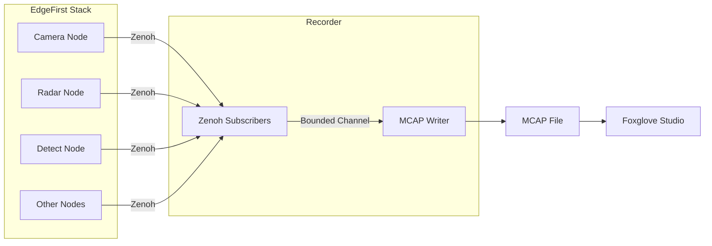
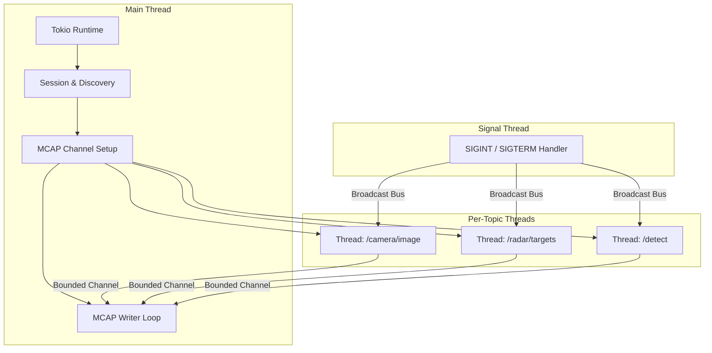
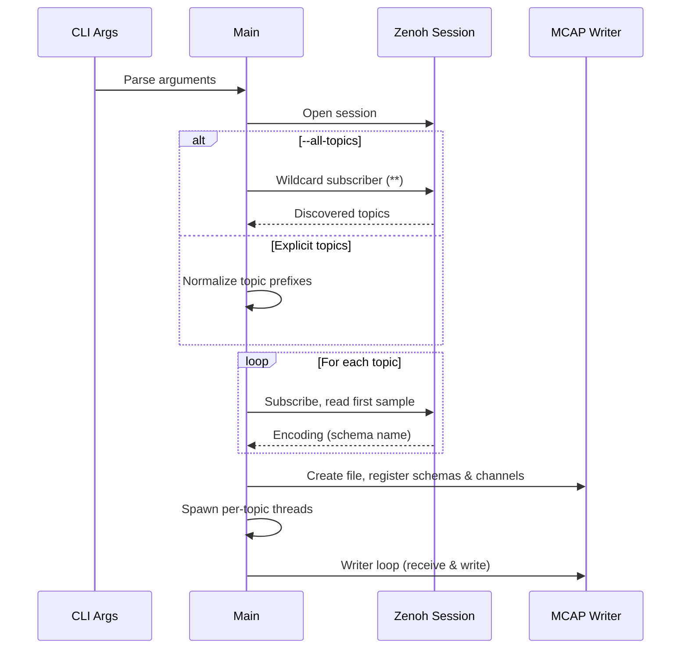
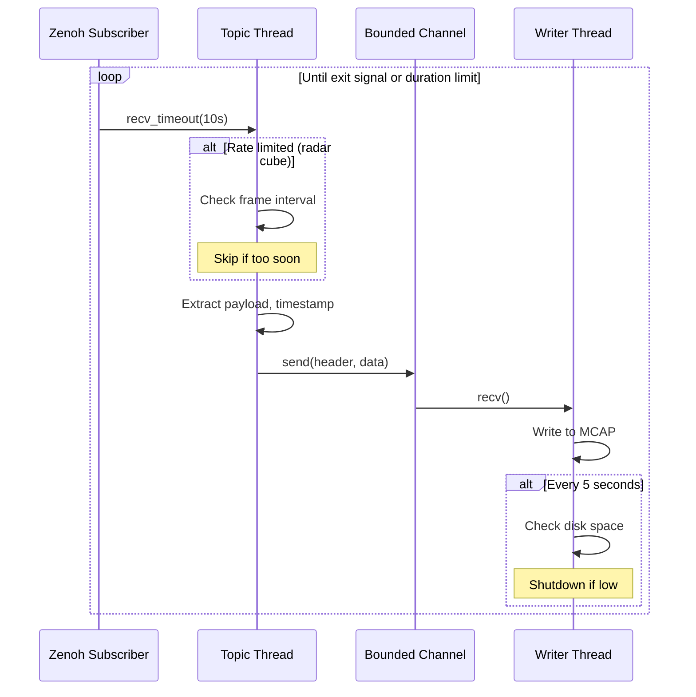
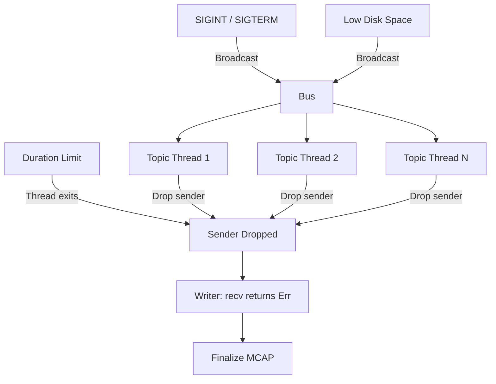
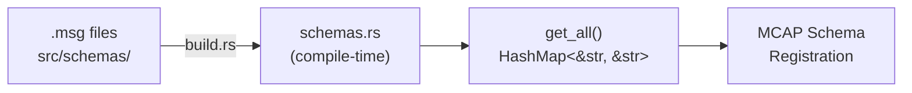

# Architecture

**Version:** 1.0
**Last Updated:** 2026-02-15

---

## Overview

EdgeFirst Recorder subscribes to Zenoh topics and writes CDR-encoded messages to MCAP files with embedded ROS 2 schemas. The resulting files are self-describing and can be opened directly in Foxglove Studio.

---

## Threading Model

The recorder uses a hybrid async/threaded architecture. The main thread runs a Tokio runtime for Zenoh session setup and topic discovery. Each topic is then recorded on a dedicated OS thread with its own single-threaded Tokio runtime for the Zenoh subscriber.

### Why Per-Topic Threads?

Zenoh subscribers use blocking `recv_timeout` for receiving samples. Dedicating a thread per topic avoids one slow topic blocking others. Each thread runs a minimal single-threaded Tokio runtime solely for the async `declare_subscriber` call.

---

## Data Flow

### Startup Sequence

### Recording Loop

---

## Shutdown

Graceful shutdown is coordinated through a broadcast bus. Any of these events triggers shutdown:

1. **Signal or low disk**: Broadcast bus notifies all topic threads to stop
2. **Duration limit**: Individual topic threads exit naturally
3. **Writer completion**: When all senders are dropped, the writer finalizes the MCAP file

---

## Schema Management

Schemas are ROS 2 `.msg` files embedded into the binary at compile time using the `include_walk` crate. The build script walks `src/schemas/` and generates a lookup table in `src/schemas.rs`.

At runtime, the recorder resolves each topic's encoding from the first received Zenoh sample, looks up the corresponding `.msg` schema, and registers it with the MCAP writer. Topics without a matching schema are skipped.

---

## Key Design Decisions

| Decision | Rationale |
|----------|-----------|
| **Bounded channel (64)** | Backpressure prevents unbounded memory growth if the writer is slower than publishers |
| **Per-topic threads** | Blocking Zenoh recv avoids one slow topic starving others |
| **Single writer thread** | MCAP writer is not thread-safe; funneling through one thread avoids locking |
| **Compile-time schemas** | No filesystem dependencies at runtime; single static binary |
| **Broadcast bus for shutdown** | Simple fan-out signal to all threads without shared atomics |
| **`SyncSender` not `Sender`** | Bounded channel for backpressure; blocks producer if writer falls behind |

---

## Dependencies

| Crate | Purpose |
|-------|---------|
| `zenoh` | Pub/sub middleware for topic subscription |
| `mcap` | MCAP file format writer |
| `clap` | CLI argument parsing with env var support |
| `anyhow` | Error handling with context |
| `tokio` | Async runtime for Zenoh operations |
| `bus` | Broadcast channel for shutdown signaling |
| `fs2` | Disk space queries |
| `signal-hook` | Unix signal handling |
| `chrono` | Timestamp formatting for filenames |
