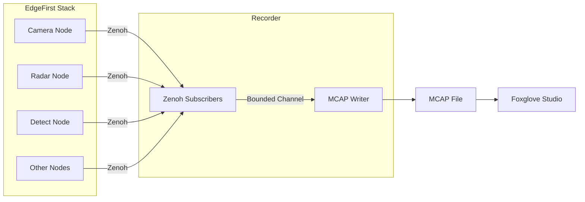
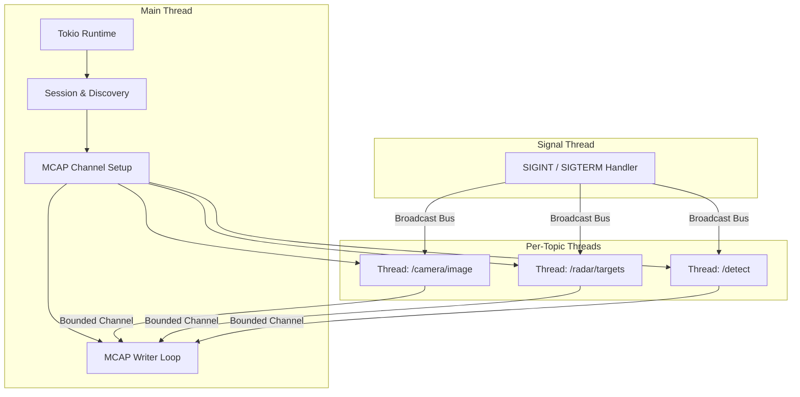
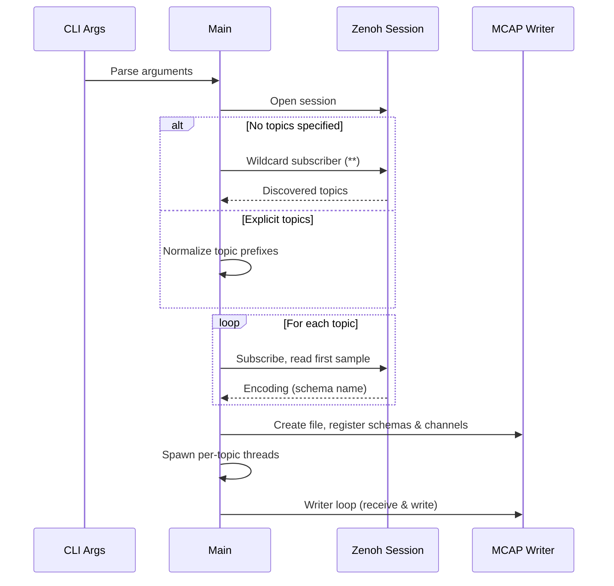
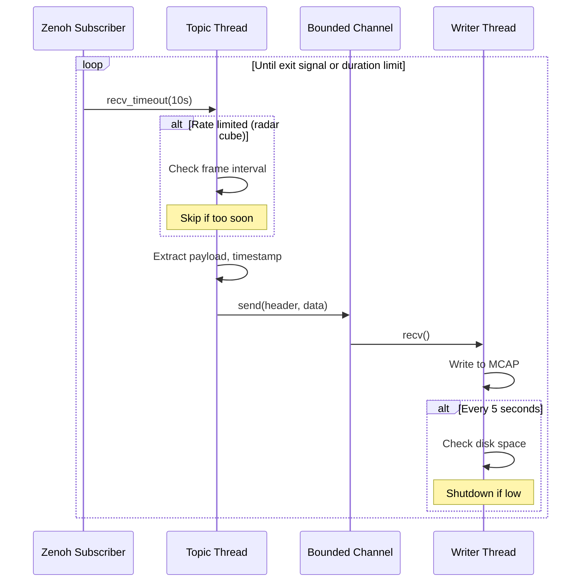
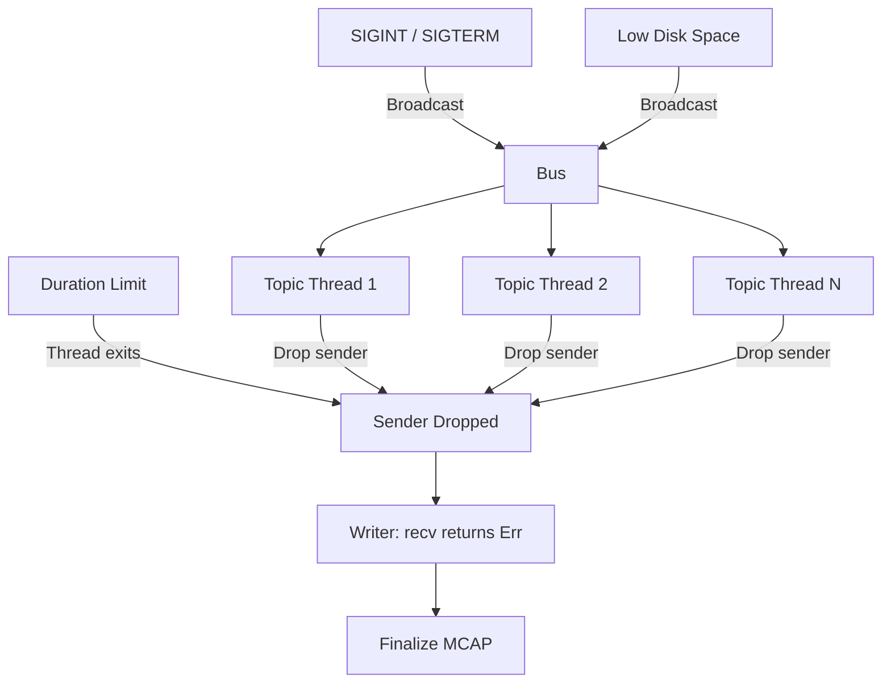
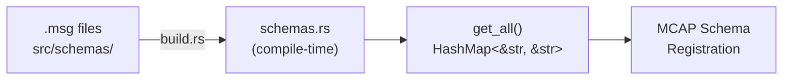

# Architecture

**Version:** 1.0
**Last Updated:** 2026-02-15

---

## Overview

EdgeFirst Recorder subscribes to Zenoh topics and writes CDR-encoded messages to MCAP files with embedded ROS 2 schemas. The resulting files are self-describing and can be opened directly in Foxglove Studio.


```mermaid
graph LR
    subgraph EdgeFirst Stack
        CAM[Camera Node]
        RAD[Radar Node]
        DET[Detect Node]
        OTHER[Other Nodes]
    end

    subgraph Recorder
        SUB[Zenoh Subscribers]
        WRITER[MCAP Writer]
    end

    OUT[MCAP File]
    FOX[Foxglove Studio]

    CAM -->|Zenoh| SUB
    RAD -->|Zenoh| SUB
    DET -->|Zenoh| SUB
    OTHER -->|Zenoh| SUB
    SUB -->|Bounded Channel| WRITER
    WRITER --> OUT
    OUT --> FOX
```

---

## Threading Model

The recorder uses a hybrid async/threaded architecture. The main thread runs a Tokio runtime for Zenoh session setup and topic discovery. Each topic is then recorded on a dedicated OS thread with its own single-threaded Tokio runtime for the Zenoh subscriber.


```mermaid
graph TB
    subgraph Main Thread
        TOKIO[Tokio Runtime]
        SETUP[Session & Discovery]
        MCAP_SETUP[MCAP Channel Setup]
        WRITER[MCAP Writer Loop]
    end

    subgraph "Per-Topic Threads"
        T1[Thread: /camera/image]
        T2[Thread: /radar/targets]
        T3[Thread: /detect]
    end

    subgraph "Signal Thread"
        SIG[SIGINT / SIGTERM Handler]
    end

    TOKIO --> SETUP --> MCAP_SETUP
    MCAP_SETUP --> T1 & T2 & T3
    MCAP_SETUP --> WRITER
    T1 & T2 & T3 -->|Bounded Channel| WRITER
    SIG -->|Broadcast Bus| T1 & T2 & T3
```

### Why Per-Topic Threads?

Zenoh subscribers use blocking `recv_timeout` for receiving samples. Dedicating a thread per topic avoids one slow topic blocking others. Each thread runs a minimal single-threaded Tokio runtime solely for the async `declare_subscriber` call.

---

## Data Flow

### Startup Sequence


```mermaid
sequenceDiagram
    participant CLI as CLI Args
    participant MAIN as Main
    participant ZENOH as Zenoh Session
    participant MCAP as MCAP Writer

    CLI->>MAIN: Parse arguments
    MAIN->>ZENOH: Open session

    alt No topics specified
        MAIN->>ZENOH: Wildcard subscriber (**)
        ZENOH-->>MAIN: Discovered topics
    else Explicit topics
        MAIN->>MAIN: Normalize topic prefixes
    end

    loop For each topic
        MAIN->>ZENOH: Subscribe, read first sample
        ZENOH-->>MAIN: Encoding (schema name)
    end

    MAIN->>MCAP: Create file, register schemas & channels
    MAIN->>MAIN: Spawn per-topic threads
    MAIN->>MCAP: Writer loop (receive & write)
```

### Recording Loop


```mermaid
sequenceDiagram
    participant SUB as Zenoh Subscriber
    participant REC as Topic Thread
    participant CH as Bounded Channel
    participant WRITER as Writer Thread

    loop Until exit signal or duration limit
        SUB->>REC: recv_timeout(10s)

        alt Rate limited (radar cube)
            REC->>REC: Check frame interval
            Note over REC: Skip if too soon
        end

        REC->>REC: Extract payload, timestamp
        REC->>CH: send(header, data)
        CH->>WRITER: recv()
        WRITER->>WRITER: Write to MCAP

        alt Every 5 seconds
            WRITER->>WRITER: Check disk space
            Note over WRITER: Shutdown if low
        end
    end
```

---

## Shutdown

Graceful shutdown is coordinated through a broadcast bus. Any of these events triggers shutdown:


```mermaid
flowchart TD
    SIG[SIGINT / SIGTERM] -->|Broadcast| BUS[Bus]
    DISK[Low Disk Space] -->|Broadcast| BUS
    DUR[Duration Limit] -->|Thread exits| DROP[Sender Dropped]

    BUS --> T1[Topic Thread 1]
    BUS --> T2[Topic Thread 2]
    BUS --> TN[Topic Thread N]

    T1 & T2 & TN -->|Drop sender| DROP
    DROP --> WRITER[Writer: recv returns Err]
    WRITER --> FIN[Finalize MCAP]
```

1. **Signal or low disk**: Broadcast bus notifies all topic threads to stop
2. **Duration limit**: Individual topic threads exit naturally
3. **Writer completion**: When all senders are dropped, the writer finalizes the MCAP file

---

## Schema Management

Schemas are ROS 2 `.msg` files embedded into the binary at compile time using the `include_walk` crate. The build script walks `src/schemas/` and generates a lookup table in `src/schemas.rs`.


```mermaid
flowchart LR
    MSG[".msg files<br/>src/schemas/"] -->|build.rs| GEN["schemas.rs<br/>(compile-time)"]
    GEN --> LOOKUP["get_all()<br/>HashMap&lt;&amp;str, &amp;str&gt;"]
    LOOKUP --> MCAP["MCAP Schema<br/>Registration"]
```

At runtime, the recorder resolves each topic's encoding from the first received Zenoh sample, looks up the corresponding `.msg` schema, and registers it with the MCAP writer. Topics without a matching schema are skipped.

### Adding a Topic / Schema

Adding support for a new ROS 2 message type is a single file drop, but the layout contract is strict because the runtime lookup is implicit.

**1. Drop the `.msg` file at the canonical path.**

```
src/schemas/<ros_package>/msg/<TypeName>.msg
```

For example, `sensor_msgs/msg/Image` lives at `src/schemas/sensor_msgs/msg/Image.msg`. The path segments must be lower-case ROS package name, literal `msg`, then the `PascalCase` type name with a `.msg` extension.

**2. No registration step.**

`build.rs` walks `src/schemas/` with `include_walk` and regenerates `src/schemas.rs` on every build. A `cargo:rerun-if-changed=src/schemas` directive ensures edits to existing `.msg` files also trigger regeneration.

**3. The implicit contract with Zenoh.**

At runtime the recorder asks the first sample for its encoding (e.g. `sensor_msgs/msg/Image`) and looks up the schema with the key `schemas/<encoding>.msg`. **If a `.msg` file is placed at a non-canonical location (e.g. missing the `msg/` segment), the runtime lookup will silently fail and the topic will be skipped with a warning.**

**4. Verification.**

- `cargo test` runs a round-trip assertion (`schema_registry_tests::every_schema_key_matches_ros2_layout`) that every embedded key matches the expected layout. Misplaced files fail the test instead of reaching production.
- Also update the "Supported Topics" table in `README.md`.
- End-to-end: record a live publisher for the new type and confirm the MCAP channel appears in Foxglove Studio with the correct schema.

### Time

MCAP records two timestamps per message. The recorder sets them as follows:

- **`log_time`** — when the recorder observed the sample (`SystemTime::now()` at receive time). This is the MCAP convention.
- **`publish_time`** — taken from the Zenoh sample timestamp (`sample.timestamp()`) when the publisher source-stamped the message, and falls back to `log_time` otherwise. The recorder logs which mode was used on the first sample of each topic, so field debugging never has to guess which clock the MCAP reflects.

Source-stamping requires the publisher to attach a Zenoh timestamp (e.g. via `put(..., timestamp=...)`); without it, `publish_time == log_time` and the MCAP loses producer-side timing but remains playable.

---

## Key Design Decisions

| Decision | Rationale |
|----------|-----------|
| **Bounded channel (64)** | Backpressure prevents unbounded memory growth if the writer is slower than publishers |
| **Per-topic threads** | Blocking Zenoh recv avoids one slow topic starving others |
| **Single writer thread** | MCAP writer is not thread-safe; funneling through one thread avoids locking |
| **Compile-time schemas** | No filesystem dependencies at runtime; single static binary |
| **Broadcast bus for shutdown** | Simple fan-out signal to all threads without shared atomics |
| **`SyncSender` not `Sender`** | Bounded channel for backpressure; blocks producer if writer falls behind |

---

## Dependencies

| Crate | Purpose |
|-------|---------|
| `zenoh` | Pub/sub middleware for topic subscription |
| `mcap` | MCAP file format writer |
| `clap` | CLI argument parsing with env var support |
| `anyhow` | Error handling with context |
| `tokio` | Async runtime for Zenoh operations |
| `bus` | Broadcast channel for shutdown signaling |
| `fs2` | Disk space queries |
| `signal-hook` | Unix signal handling |
| `chrono` | Timestamp formatting for filenames |
| `log`, `env_logger` | Logging facade and environment-driven logger |
| `hostname` | Host name lookup for MCAP filenames |
| `serde_json` | Zenoh configuration JSON5 snippets |
| `include_walk` (build-dep) | Compile-time schema discovery |
