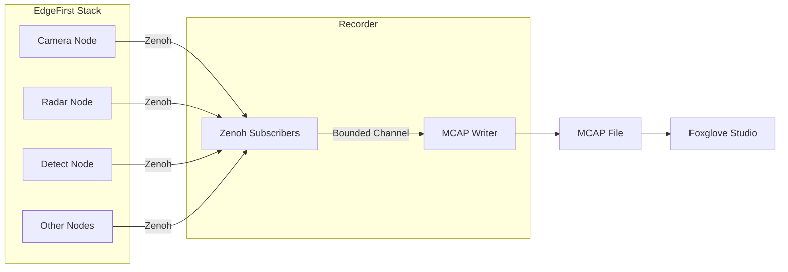
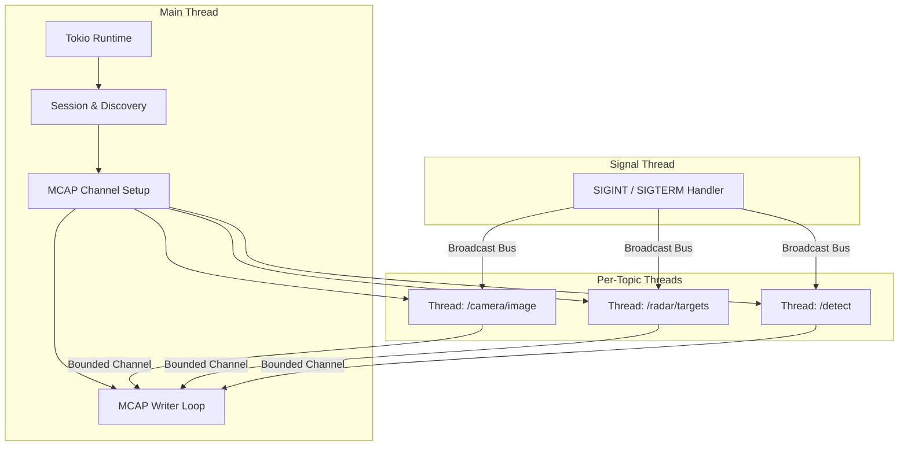
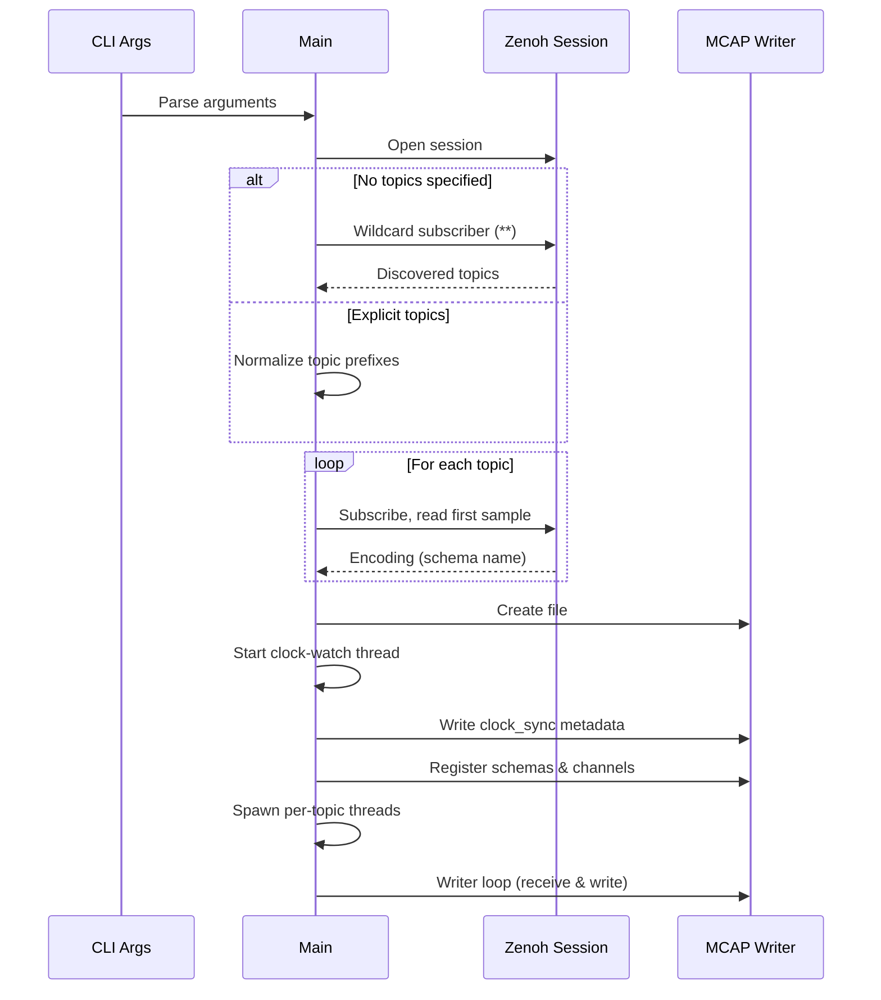
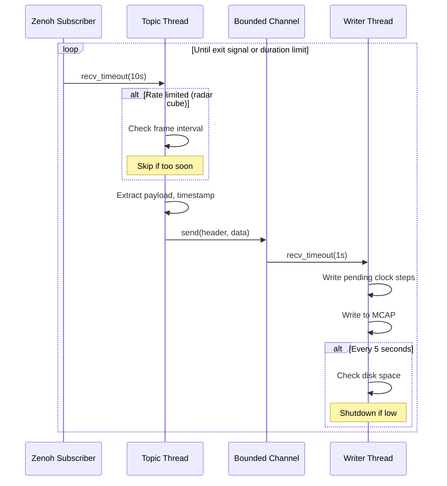
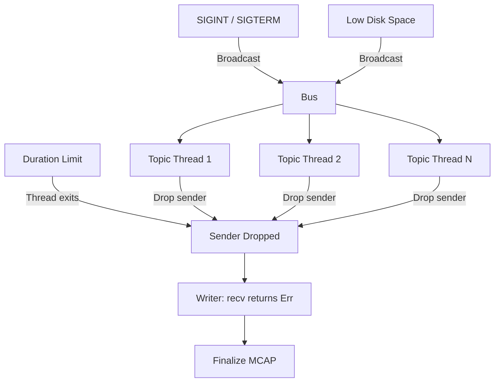
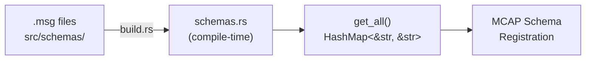

# Architecture

**Version:** 1.0
**Last Updated:** 2026-02-15

---

## Overview

EdgeFirst Recorder subscribes to Zenoh topics and writes CDR-encoded messages to MCAP files with embedded ROS 2 schemas. The resulting files are self-describing and can be opened directly in Foxglove Studio.


```mermaid
graph LR
    subgraph EdgeFirst Stack
        CAM[Camera Node]
        RAD[Radar Node]
        DET[Detect Node]
        OTHER[Other Nodes]
    end

    subgraph Recorder
        SUB[Zenoh Subscribers]
        WRITER[MCAP Writer]
    end

    OUT[MCAP File]
    FOX[Foxglove Studio]

    CAM -->|Zenoh| SUB
    RAD -->|Zenoh| SUB
    DET -->|Zenoh| SUB
    OTHER -->|Zenoh| SUB
    SUB -->|Bounded Channel| WRITER
    WRITER --> OUT
    OUT --> FOX
```

---

## Threading Model

The recorder uses a hybrid async/threaded architecture. The main thread runs a Tokio runtime for Zenoh session setup and topic discovery. Each topic is then recorded on a dedicated OS thread with its own single-threaded Tokio runtime for the Zenoh subscriber.


```mermaid
graph TB
    subgraph Main Thread
        TOKIO[Tokio Runtime]
        SETUP[Session & Discovery]
        MCAP_SETUP[MCAP Channel Setup]
        WRITER[MCAP Writer Loop]
    end

    subgraph "Per-Topic Threads"
        T1[Thread: /camera/image]
        T2[Thread: /radar/targets]
        T3[Thread: /detect]
    end

    subgraph "Signal Thread"
        SIG[SIGINT / SIGTERM Handler]
    end

    TOKIO --> SETUP --> MCAP_SETUP
    MCAP_SETUP --> T1 & T2 & T3
    MCAP_SETUP --> WRITER
    T1 & T2 & T3 -->|Bounded Channel| WRITER
    SIG -->|Broadcast Bus| T1 & T2 & T3
```

A clock-watch thread blocks on a Linux `timerfd` and wakes only when `CLOCK_REALTIME` is set discontinuously (see [Clock Steps](#clock-steps)). It sends detected steps to the writer on a dedicated unbounded channel, so it never holds the message channel open during shutdown.

### Why Per-Topic Threads?

Zenoh subscribers use blocking `recv_timeout` for receiving samples. Dedicating a thread per topic avoids one slow topic blocking others. Each thread runs a minimal single-threaded Tokio runtime solely for the async `declare_subscriber` call.

---

## Data Flow

### Startup Sequence


```mermaid
sequenceDiagram
    participant CLI as CLI Args
    participant MAIN as Main
    participant ZENOH as Zenoh Session
    participant MCAP as MCAP Writer

    CLI->>MAIN: Parse arguments
    MAIN->>ZENOH: Open session

    alt No topics specified
        MAIN->>ZENOH: Wildcard subscriber (**)
        ZENOH-->>MAIN: Discovered topics
    else Explicit topics
        MAIN->>MAIN: Normalize topic prefixes
    end

    loop For each topic
        MAIN->>ZENOH: Subscribe, read first sample
        ZENOH-->>MAIN: Encoding (schema name)
    end

    MAIN->>MCAP: Create file
    MAIN->>MAIN: Start clock-watch thread
    MAIN->>MCAP: Write clock_sync metadata
    MAIN->>MCAP: Register schemas & channels
    MAIN->>MAIN: Spawn per-topic threads
    MAIN->>MCAP: Writer loop (receive & write)
```

### Recording Loop


```mermaid
sequenceDiagram
    participant SUB as Zenoh Subscriber
    participant REC as Topic Thread
    participant CH as Bounded Channel
    participant WRITER as Writer Thread

    loop Until exit signal or duration limit
        SUB->>REC: recv_timeout(10s)

        alt Rate limited (radar cube)
            REC->>REC: Check frame interval
            Note over REC: Skip if too soon
        end

        REC->>REC: Extract payload, timestamp
        REC->>CH: send(header, data)
        CH->>WRITER: recv_timeout(1s)
        WRITER->>WRITER: Write pending clock steps
        WRITER->>WRITER: Write to MCAP

        alt Every 5 seconds
            WRITER->>WRITER: Check disk space
            Note over WRITER: Shutdown if low
        end
    end
```

---

## Shutdown

Graceful shutdown is coordinated through a broadcast bus. Any of these events triggers shutdown:


```mermaid
flowchart TD
    SIG[SIGINT / SIGTERM] -->|Broadcast| BUS[Bus]
    DISK[Low Disk Space] -->|Broadcast| BUS
    DUR[Duration Limit] -->|Thread exits| DROP[Sender Dropped]

    BUS --> T1[Topic Thread 1]
    BUS --> T2[Topic Thread 2]
    BUS --> TN[Topic Thread N]

    T1 & T2 & TN -->|Drop sender| DROP
    DROP --> WRITER[Writer: recv returns Err]
    WRITER --> FIN[Finalize MCAP]
```

1. **Signal or low disk**: Broadcast bus notifies all topic threads to stop
2. **Duration limit**: Individual topic threads exit naturally
3. **Writer completion**: When all senders are dropped, the writer finalizes the MCAP file

---

## Schema Management

Schemas are ROS 2 `.msg` files embedded into the binary at compile time using the `include_walk` crate. The build script walks `src/schemas/` and generates a lookup table in `src/schemas.rs`.


```mermaid
flowchart LR
    MSG[".msg files<br/>src/schemas/"] -->|build.rs| GEN["schemas.rs<br/>(compile-time)"]
    GEN --> LOOKUP["get_all()<br/>HashMap&lt;&amp;str, &amp;str&gt;"]
    LOOKUP --> MCAP["MCAP Schema<br/>Registration"]
```

At runtime, the recorder resolves each topic's encoding from the first received Zenoh sample, looks up the corresponding `.msg` schema, and registers it with the MCAP writer. Topics without a matching schema are skipped.

### Adding a Topic / Schema

Adding support for a new ROS 2 message type is a single file drop, but the layout contract is strict because the runtime lookup is implicit.

**1. Drop the `.msg` file at the canonical path.**

```
src/schemas/<ros_package>/msg/<TypeName>.msg
```

For example, `sensor_msgs/msg/Image` lives at `src/schemas/sensor_msgs/msg/Image.msg`. The path segments must be lower-case ROS package name, literal `msg`, then the `PascalCase` type name with a `.msg` extension.

**2. No registration step.**

`build.rs` walks `src/schemas/` with `include_walk` and regenerates `src/schemas.rs` on every build. A `cargo:rerun-if-changed=src/schemas` directive ensures edits to existing `.msg` files also trigger regeneration.

**3. The implicit contract with Zenoh.**

At runtime the recorder asks the first sample for its encoding (e.g. `sensor_msgs/msg/Image`) and looks up the schema with the key `schemas/<encoding>.msg`. **If a `.msg` file is placed at a non-canonical location (e.g. missing the `msg/` segment), the runtime lookup will silently fail and the topic will be skipped with a warning.**

**4. Verification.**

- `cargo test` runs a round-trip assertion (`schema_registry_tests::every_schema_key_matches_ros2_layout`) that every embedded key matches the expected layout. Misplaced files fail the test instead of reaching production.
- Also update the "Supported Topics" table in `README.md`.
- End-to-end: record a live publisher for the new type and confirm the MCAP channel appears in Foxglove Studio with the correct schema.

### Time

MCAP records two timestamps per message. The recorder sets them as follows:

- **`log_time`** — when the recorder observed the sample (`SystemTime::now()` at receive time). This is the MCAP convention.
- **`publish_time`** — taken from the Zenoh sample timestamp (`sample.timestamp()`) when the publisher source-stamped the message, and falls back to `log_time` otherwise. The recorder logs which mode was used on the first sample of each topic, so field debugging never has to guess which clock the MCAP reflects.

Source-stamping requires the publisher to attach a Zenoh timestamp (e.g. via `put(..., timestamp=...)`); without it, `publish_time == log_time` and the MCAP loses producer-side timing but remains playable.

The first time a topic's `publish_time` differs from `log_time` by more than 10 s, the recorder logs a warning for that topic. The values are still recorded unchanged so the fault stays visible in the file.

The `--duration` limit and all internal intervals are measured on the monotonic clock (`Instant`), so a wall-clock step neither ends a recording early nor extends it.

### Clock Steps

Devices without a working RTC boot with a wrong wall clock that chrony later steps, possibly by months, at any time during a recording. The recorder keeps writing the same file and marks the step so consumers can treat it as a boundary between two internally consistent segments.

**Detection.** The clock-watch thread owns a `timerfd` on `CLOCK_REALTIME` armed with `TFD_TIMER_ABSTIME | TFD_TIMER_CANCEL_ON_SET` and an expiry at the end of `time_t`. `read()` fails with `ECANCELED` whenever `CLOCK_REALTIME - CLOCK_MONOTONIC` changes discontinuously: `settimeofday`/`clock_settime`, `adjtimex(ADJ_SETOFFSET)` (chrony's step), a kernel leap second, or resume from suspend. Slews never trigger it. `CLOCK_MONOTONIC` does not advance while suspended, so a suspend longer than 1 s is recorded as a forward step of its duration; Maivin devices do not suspend. The kernel refreshes the fd's reference offset when it reports `ECANCELED`, so the fd is kept and never re-armed; several steps between two reads are reported once.

After each wake-up the thread measures `CLOCK_REALTIME - CLOCK_MONOTONIC`. The two clocks cannot be read atomically, so it reads REALTIME, MONOTONIC, REALTIME and compares the monotonic value with the midpoint of the two realtime reads, retrying while the bracket exceeds 10 µs. A change larger than 1 s since the previous measurement is a step. Slews move both clocks together, so only steps change the offset. If the `timerfd` cannot be created, the writer measures the offset before every message instead.

**`clock_step` metadata.** Each step is written as an MCAP Metadata record named `clock_step`. MCAP Metadata has no timestamp field and carries only strings, so the instant is in the values:

| Key | Value |
|-----|-------|
| `log_time_before` | Wall time just before the step, ns since the UNIX epoch |
| `log_time_after` | Wall time just after the step, ns since the UNIX epoch |
| `step_ns` | Signed step size in ns (`log_time_after - log_time_before`) |
| `monotonic_ns` | `CLOCK_MONOTONIC` when the step was detected, ns |
| `detection` | `timerfd`, or `sample` when found by an offset comparison |

A file holds one `clock_step` record per step, all with the same name. Readers should enumerate the summary's Metadata Index records (mcap-rs `Summary::metadata_indexes` with `mcap::read::metadata`). A file without a summary, for example after power loss, must be scanned linearly (`LinearReader` with `Options::IgnoreEndMagic`); `MessageStream` skips Metadata records. The `mcap` CLI `get metadata` command merges records that share a name.

**`/clock_step` channel.** Foxglove shows Metadata records as recording-level context, not on the timeline, so each step is also written as a JSON message on the root topic `/clock_step` (schema `edgefirst/ClockStep`, encoding `jsonschema`, message encoding `json`) with `log_time = publish_time = log_time_after`. The channel is created on the first step, so recordings without steps do not contain it. The Metadata record is authoritative. Consumers that replay or convert recordings must skip this channel.

**`clock_sync` metadata.** One record named `clock_sync` is written when the file is opened:

| Key | Value |
|-----|-------|
| `open_realtime_ns` | `CLOCK_REALTIME` at file open, ns |
| `boot_epoch_ns` | `CLOCK_REALTIME - CLOCK_MONOTONIC` at file open: the wall time of boot. Adding `step_ns` of each earlier `clock_step` maps any later `monotonic_ns` to wall time |
| `synchronized` | `true`, `false`, or `unknown` |
| `source` | `chronyc`, `adjtimex`, or `none` |
| `reference_id`, `reference_name`, `stratum`, `system_time_offset_s`, `root_dispersion_s`, `leap_status` | From `chronyc -c -n tracking`, when chrony answers within 2 s |
| `kernel_unsync`, `maxerror_us`, `esterror_us` | From `adjtimex` with `modes = 0` |

`synchronized` comes from chrony's leap status when chrony answers, and from the kernel `STA_UNSYNC` flag otherwise. Chrony clears `STA_UNSYNC` only when `rtcsync` is enabled and every step sets it again, so the kernel flag alone under-reports synchronization. `chronyc tracking` works unprivileged over 127.0.0.1:323 unless chrony runs with `cmdport 0`.

---

## Key Design Decisions

| Decision | Rationale |
|----------|-----------|
| **Bounded channel (64)** | Backpressure prevents unbounded memory growth if the writer is slower than publishers |
| **Per-topic threads** | Blocking Zenoh recv avoids one slow topic starving others |
| **Single writer thread** | MCAP writer is not thread-safe; funneling through one thread avoids locking |
| **Compile-time schemas** | No filesystem dependencies at runtime; single static binary |
| **Broadcast bus for shutdown** | Simple fan-out signal to all threads without shared atomics |
| **`SyncSender` not `Sender`** | Bounded channel for backpressure; blocks producer if writer falls behind |
| **One file per recording across clock steps** | A step is marked with `clock_step` metadata, never split, so a recording stays one artifact and consumers segment it |
| **`timerfd` for clock steps** | Event-driven, no polling; the same kernel mechanism systemd uses to notice time changes |
| **Separate channel for clock steps** | The watcher never keeps the message channel open, so shutdown still completes when all topic threads exit |

---

## Dependencies

| Crate | Purpose |
|-------|---------|
| `zenoh` | Pub/sub middleware for topic subscription |
| `mcap` | MCAP file format writer |
| `clap` | CLI argument parsing with env var support |
| `anyhow` | Error handling with context |
| `tokio` | Async runtime for Zenoh operations |
| `bus` | Broadcast channel for shutdown signaling |
| `fs2` | Disk space queries |
| `signal-hook` | Unix signal handling |
| `chrono` | Timestamp formatting for filenames |
| `log`, `env_logger` | Logging facade and environment-driven logger |
| `hostname` | Host name lookup for MCAP filenames |
| `serde_json` | Zenoh configuration JSON5 snippets and `/clock_step` messages |
| `libc` | `timerfd`, `clock_gettime`, and `adjtimex` for clock step detection |
| `include_walk` (build-dep) | Compile-time schema discovery |
